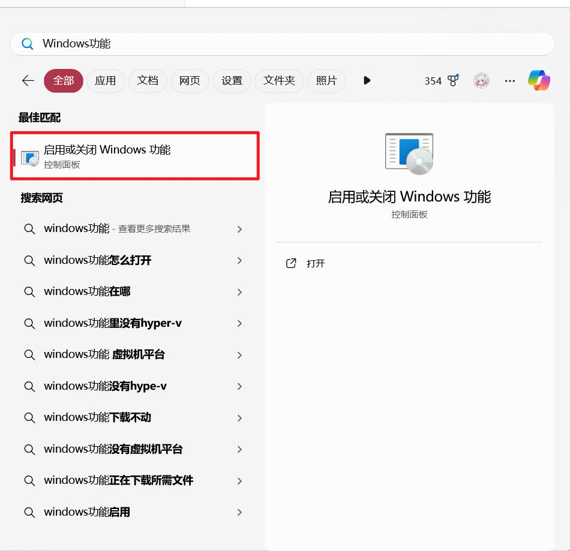
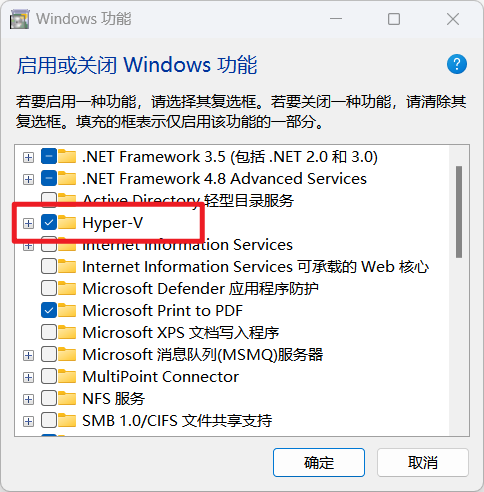
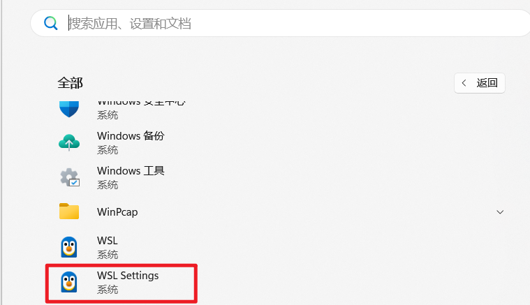
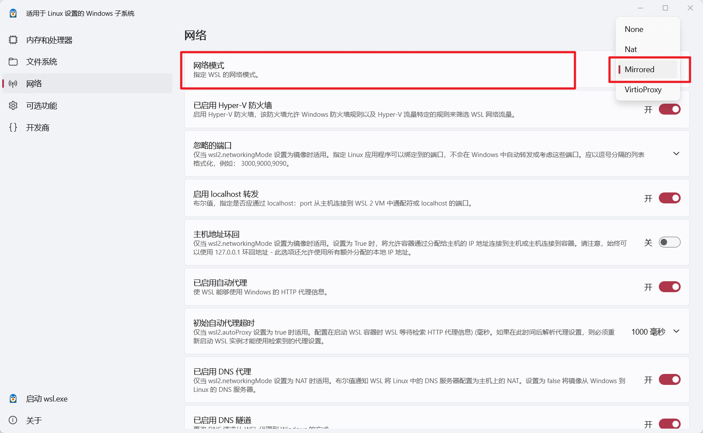

**WSL2安装Ubuntu22.04过程记录2024**

[toc]


# 前言

最近学习清华大学的Ventus(乘影) GPGPU，按照官方教程搭建开发环境。

作者推荐使用WSL2作为开发环境，但是官方给的[从零开始的环境配置教程](https://zhuanlan.zhihu.com/p/586445036)已经过时，因此记录一下本人于2024年11月14日重新搭建环境的过程。

大体上参考原文教程，但是删除了诸多过时和失效的内容，增添了更简单的操作方法，力求实现同样的最终效果。

**预先说明，本人Host Windows11已经配置好科学上网环境。如果安装过程遇到本文未提到的网络问题，应该是你的Windows主机网络代理未设置好。**


# 1.开启hyper-V

在Windows11 PC搜索**Windows功能**，随后在其中勾选hyper-V全部功能，等待Windows自动完成安装。

注意在启用此功能前，需要在主板BIOS设置页面启用**虚拟化**相关的功能。否则可能造成不确定的错误。







安装完成可能提示需要重启电脑，重启即可。


# 2.安装WSL2并共享host网络代理

打开power shell：

```powershell
wsl --set-default-version 2
```

把要安装的WSL版本设置为WSL2.


然后：

```powershell
wsl --install -d Ubuntu-22.04
```

如果想安装其他版本，可以通过`wsl --list --online`命令查看官方提供的其他标准安装包。把上述命令中`Ubuntu-22.04`换成对应需要的版本名即可。

安装完成后，可能提示又需要重启电脑，再次重启即可。（如果没遇到则不用管这一步）

按照提示输入WSL Ubuntu22.04 系统主账户的用户名和自己想要设置的密码。

随后应该就能进入你刚创建的账户的home目录了。

注意，在当前为止还是只有命令行模式的（GUI后面会说）

这个时候可能会弹出网络代理相关的报错：

```bash
wsl: 检测到 localhost 代理配置，但未镜像到 wsl。nat 模式下的 wsl 不支持 localhost 代理。
```

现在，关闭掉WSL：

关掉WSL的终端窗口，然后打开一个新的terminal：

```powershell
wsl --shutdown
```

然后去Windows开始菜单找**WSL设置**，打开修改WSL网络配置：




把网络模式调为“镜像”模式：




此时，WSL内部不用做任何设置，即可共享Host Windows端的代理软件，科学上网。


